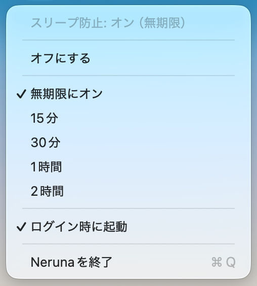

# Neruna

macOS のメニューバーに常駐し、`caffeinate` で Mac のスリープを防止する小さなアプリ。名前は「寝るな」から。



## 機能

### スリープ防止

- ディスプレイのスリープとシステムのアイドルスリープをまとめて防止(`caffeinate -di`)
- 無期限にオン、または 15 分 / 30 分 / 1 時間 / 2 時間の時間指定(`caffeinate -t`)
- 時間指定は caffeinate 側で自動終了するので、切り忘れても勝手に元へ戻る
- メニュー先頭に現在の状態と残り時間を表示(「スリープ防止: オン(残り 29 分)」)

### 常駐まわり

- メニューバーアイコンで状態がひと目で分かる
  - オン: 塗りつぶし(`cup.and.saucer.fill`) / オフ: グレーアウト
- ログイン時に自動起動のトグル(.app バンドルで起動しているときのみ)
- アプリを終了すると caffeinate も道連れで終了するので、プロセスが残らない

## 必要なもの

- macOS 13 (Ventura)+
- `caffeinate` は macOS 標準のため、追加の依存はなし

## インストール

```sh
brew install --cask nemooon/tap/neruna
xattr -dr com.apple.quarantine /Applications/Neruna.app
```

Apple Developer ID 署名なしのため、macOS が quarantine 属性を付けて起動を
ブロックします。上の `xattr` で属性を外してから起動してください。
または、一度起動を試したあと「システム設定 → プライバシーとセキュリティ」の
セキュリティ欄で「このまま開く」を選びます。

> macOS 15 (Sequoia) 以降、右クリック →「開く」による回避は
> [Apple が削除](https://www.idownloadblog.com/2024/08/07/apple-macos-sequoia-gatekeeper-change-install-unsigned-apps-mac/)しました。
> `brew install --cask --no-quarantine` も Homebrew 6.x で廃止されているため、
> 現状 `xattr` が唯一のコマンドラインでの手段です。

## ソースから実行

```sh
swift run
```

## .app としてビルド

```sh
./make-app.sh
open dist   # "Neruna.app" をアプリケーションフォルダへ
```

ログイン時の自動起動は、メニューの「ログイン時に起動」から設定できます。

## アイコン

- `Icon/Neruna.icon` — Icon Composer 用のデザイン原本(Liquid Glass 対応)。
  `open Icon/Neruna.icon` で編集できます
- `Icon/icon-flat.svg` — `.icns` 生成用の合成版
- `./make-icns.sh` — `Icon/Neruna.icns` を再生成。Icon Composer で調整した場合は
  1024x1024 の PNG に書き出して `./make-icns.sh <書き出したPNG>` で反映

`.icon` を直接アプリに組み込むにはフル Xcode(actool)が必要なため、
Command Line Tools のみの環境では `.icns` を `make-app.sh` がバンドルに同梱します。

## リリース

1. `make-app.sh` の `VERSION` を上げてコミット・push
2. `./make-release.sh` — ビルド → zip → GitHub リリースを作成
3. リリース公開をトリガーに `.github/workflows/bump-cask.yml` が動き、
   [nemooon/homebrew-tap](https://github.com/nemooon/homebrew-tap) の
   `Casks/neruna.rb` の version と sha256 を自動更新します

ワークフローには tap へ push できる PAT を `TAP_GITHUB_TOKEN` として
リポジトリシークレットに登録しておく必要があります。

## 補足

- 中身は `/usr/bin/caffeinate -di`(時間指定時は `-t <秒>` を追加)をサブプロセスとして
  起動・停止するだけの薄いラッパーです。依存ライブラリなし、AppKit のみ
  - `Sources/Neruna/CaffeinateController.swift` — caffeinate プロセスの管理
  - `Sources/Neruna/AppDelegate.swift` — NSStatusItem とメニュー
- ログイン項目は「いま起動している .app のパス」で登録されます。`dist/` から起動した
  まま有効にすると、あとで移動したときに古いパスを指したままになるので注意
- 蓋を閉じてもスリープさせない用途には使えません。`caffeinate -di` が防ぐのは
  アイドルスリープだけで、蓋閉じによる強制スリープは対象外です
  (`caffeinate -s` で防げますが AC 電源接続時のみ有効)

## ライセンス

[MIT](LICENSE)

## クレジット

このアプリは [Claude Code](https://claude.com/claude-code)(Claude Fable 5)とのペアプログラミングで作られました。
